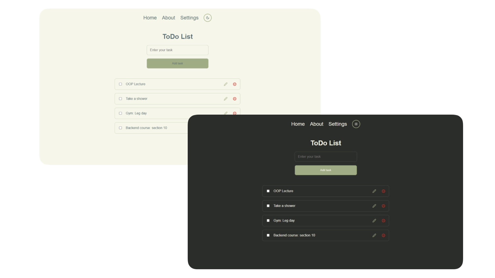
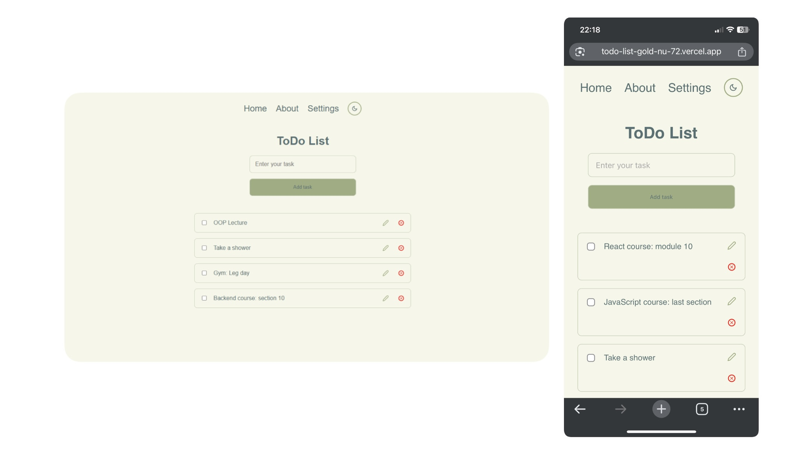
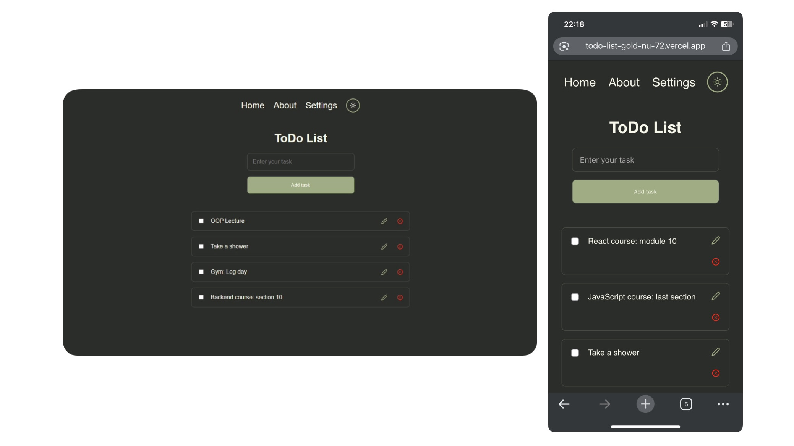

# 📝 ToDo List App

A basic to-do list app built as a practice project while learning React.  
It is a simple **CRUD application** that allows users to manage tasks with **create, read, update, and delete** operations.

Tasks are stored using **local browser storage**, ensuring data persists between sessions without the need for a backend.

---

## 🚀 Features

- ✅ Create, update, delete, and toggle tasks
- 🎨 Light/Dark **theme switching** using **CSS variables**
- 🌐 Persistent theme using a **custom `ThemeProvider` hook**
- 💾 Data persistence via `localStorage`
- ⚛️ Built with **React** and **Vite**
- ⚡ Uses **pnpm** for fast, efficient dependency management

---

## 🔗 Live Demo

**[👉 Try it now](https://todo-list-gold-nu-72.vercel.app/)**  

---

## 📸 Screenshots


---

---


---

## 🛠️ Tech Stack

- **React** (with hooks and Context API)
- **Vite**
- **JavaScript**
- **CSS Modules / CSS Variables**
- **pnpm**

---

## 📦 Getting Started

### 1. Clone the repo

```bash
git clone https://github.com/xncee/todo-list
cd todo-list
```
### 2. Install dependencies using pnpm

```bash
pnpm install
```

### 3. Run the development server

```bash
pnpm dev
```

### 4. Build for production

```bash
pnpm build
```

---

## 🌐 Project Structure

```
src/
├── components/           # Reusable UI components
│   └── ...
├── context/
│   └── ThemeContext.jsx  # Theme context provider and hook
├── pages/                # Application pages
│   └── Home.jsx          
│   └── About.jsx         
│   └── Settings.jsx      
│   └── PageNotFound.jsx  
├── styles/
│   └── themes/           # Light & dark theme variables
│       ├── dark.js       
│       └── light.js       
├── App.jsx               # Main app component
├── main.jsx              # Entry point for React

public/
├── assets/               # Public assets
│   └── images/
│       └── logo.png      # App logo

index.html                # Main HTML file (root directory for Vite)
```
---

## 💡 Highlights

- 🧠 ThemeProvider context injects light/dark themes into :root using CSS variables
- 🌓 `useTheme()` custom hook allows easy theme toggling from any component
- 🧹 Clean and minimal UI designed for productivity
- 🔄 No backend – tasks and theme are stored entirely in-browser

---

## 📚 Project Purpose

This app was created as part of a React learning journey, with the goal of:

- Practicing component design and composition
- Implementing CRUD logic with local storage
- Managing global state using context
- Exploring CSS variable-based theming and dynamic injection
- Gaining experience with Vite and pnpm in a real-world project

---

## 📄 License

This project is open-source and free to use.
